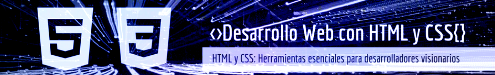
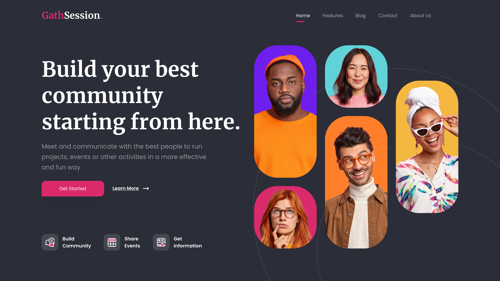

  

---

This project reflects my passion for web development through an exclusive header, specifically designed for an online forum using HTML, CSS, and Sass. Every detail of this component has been meticulously crafted to stand out in your personal portfolio, delivering a visually optimized experience for screens 1200px wide.

## 📁 Repository Structure

The repository includes a functional header with links to various sections, designed to enhance the presentation of a personal portfolio. The following technologies are utilized in this project:

| Tecnología | Enlace |
|------------|--------|
| **HTML**   | |
| **CSS**    |   |
| **SASS**   | |

---

<h2 align="center">
  Header: Online Forum
</h2>

 

## 🛠️ Resources Used

🌐 Google Fonts: The Poppins and Merriweather typefaces have been selected to bring elegance and sophistication to the design, creating a harmonious blend of modernity and tradition.

## Contributions 🤝

Your participation is valuable! If you have ideas, improvements, or find any issues, feel free to:

- Open issues to report bugs or suggest improvements.
- Create pull requests to propose changes directly.
- Share your feedback and experiences to help refine these examples.

Every contribution counts towards building together. 🌟

## Professional Services 💼

I am available to work on web design projects, whether for individuals or businesses. Do you have a project in mind, or need assistance with your website?

Let’s talk and bring your digital vision to life! 🚀
 

## Licencia 📜

This project is licensed under the  [MIT] - Check the [LICENSE](LICENSE) file for more details.

---

  

---

Este proyecto refleja mi pasión por el desarrollo web a través de un header exclusivo, diseñado específicamente para un foro en línea utilizando HTML, CSS y Sass. Cada detalle de este componente ha sido cuidadosamente creado para destacar en tu portafolio personal, ofreciendo una experiencia visual optimizada para pantallas de 1200px de ancho

## 📁 Contenido del Repositorio

El repositorio contiene un header funcional con enlaces a diferentes secciones, diseñado para realzar la presentación de un portafolio personal. En este proyecto se emplean las siguientes tecnologías:

| Tecnología | Enlace |
|------------|--------|
| **HTML**   | |
| **CSS**    |   |
| **SASS**   | |

---

<h2 align="center">
  Header: Online Forum
</h2>

  

## 🛠️ Recursos Utilizados

🌐 Google Fonts: Las tipografías Poppins y Merriweather han sido seleccionadas para aportar elegancia y sofisticación al diseño, creando una armoniosa combinación de modernidad y tradición.

## Contribuciones 🤝

¡Tu participación es valiosa! Si tienes ideas, mejoras o encuentras algún problema, siéntete libre de:

Abrir issues para reportar errores o sugerir mejoras.
Realizar pull requests para proponer cambios directamente.
Compartir tus comentarios y experiencias para ayudar a perfeccionar estos ejemplos.
Cada aportación cuenta para seguir construyendo juntos. 🌟

## Servicios Profesionales 💼

Estoy disponible para trabajar en proyectos de diseño web, ya sea para particulares o empresas. ¿Tienes un proyecto en mente o necesitas asistencia con tu sitio web?

¡Hablemos y hagamos realidad tu visión digital! 🚀
 

## Licencia 📜

Este proyecto está bajo la licencia [MIT] - Consulta el archivo [LICENSE](LICENSE) para más detalles.
